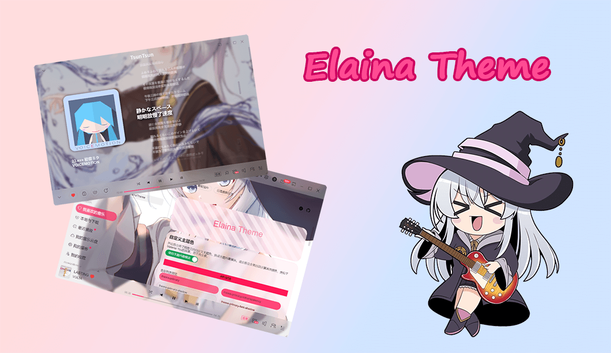
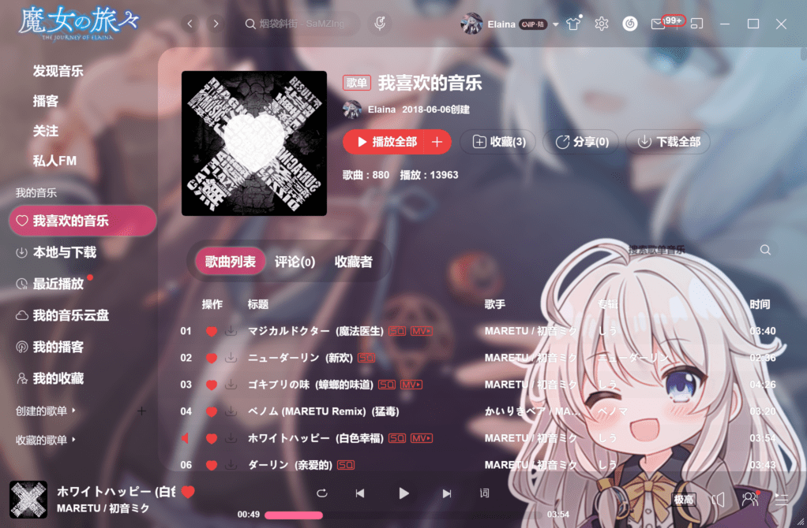

# BetterNCM Elaina Theme

### 简介

一款简单粗暴的主题插件，目的是自用与分享，主要使用CSS编写，并减少JavaScript的使用量。

### 主要功能

布局优化，精简无用组件（直播、推荐等），卡片组件圆角化；全局的随机依蕾娜背景（图库Api: https://pic.majokeiko.com ）；后续更新自定义背景图功能。

我觉得更好看的播放界面，优化了动画，删掉了没必要的组件。

做了一点功能的选择开关。

可以自己修改主题强调色，调整毛玻璃效果。

播放列表的界面没做过多处理，改了个菜单栏，统一风格。

新的评论区卡片，照顾一下看评论的人，我觉得比原版好看，且更高效。

### 备注

安装该插件时，建议不要安装其他插件，该插件也不需要任何依赖。

自动编译的版本可以在Actions里下载到，另外有Bug欢迎提issues。
