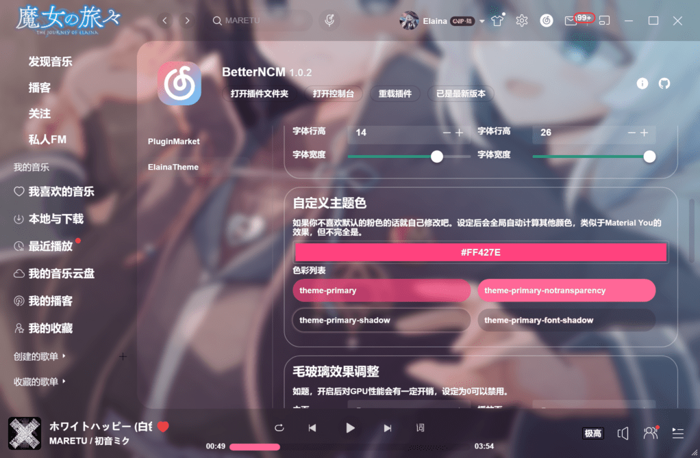

# BetterNCM Elaina Theme

### 简介

一款简单粗暴的主题插件，目的是自用与分享，主要使用CSS编写，并且非常不合群地不用React而是Vue。

过段时间准备用TS重写了，而且也没什么想要的功能了，所以不再维护。

### 主要功能

布局优化，默认精简无用组件（直播、推荐等），卡片组件圆角化，少量的插件自定义功能。

我觉得更好看的播放界面，优化了动画，删掉了没必要的组件。

当然播放界面是可以调整的，防止和其他插件产生冲突。

两种歌名显示方式，我更喜欢上面那种。

这个歌词也是可以做调整的，但是我建议保持默认（

可以自定义组件颜色，不同于官方的那个，也不是MD3的那个，我更喜欢自己写的这个取色器。

可以调整毛玻璃效果，每个人喜欢的模糊度都是不一样的。

背景自定义属于重复造轮子，但是这个功能更单一，实现也很简单。

为什么要叫波奇酱小挂件，原因是一开始随便做的功能所以只有波奇，没想到喜欢的人还挺多的，于是做成了可以自定义的。后面我又想要伊蕾娜，于是加了一点预设，就变成现在这个样子了。

自定义Logo，也是非常简单的功能，未来也许会做和波奇一样的预设功能。

### 备注

安装该插件时，建议不要安装其他插件，该插件也不需要任何依赖。

自动编译的版本可以在Actions里下载到，另外有Bug欢迎提issues。
